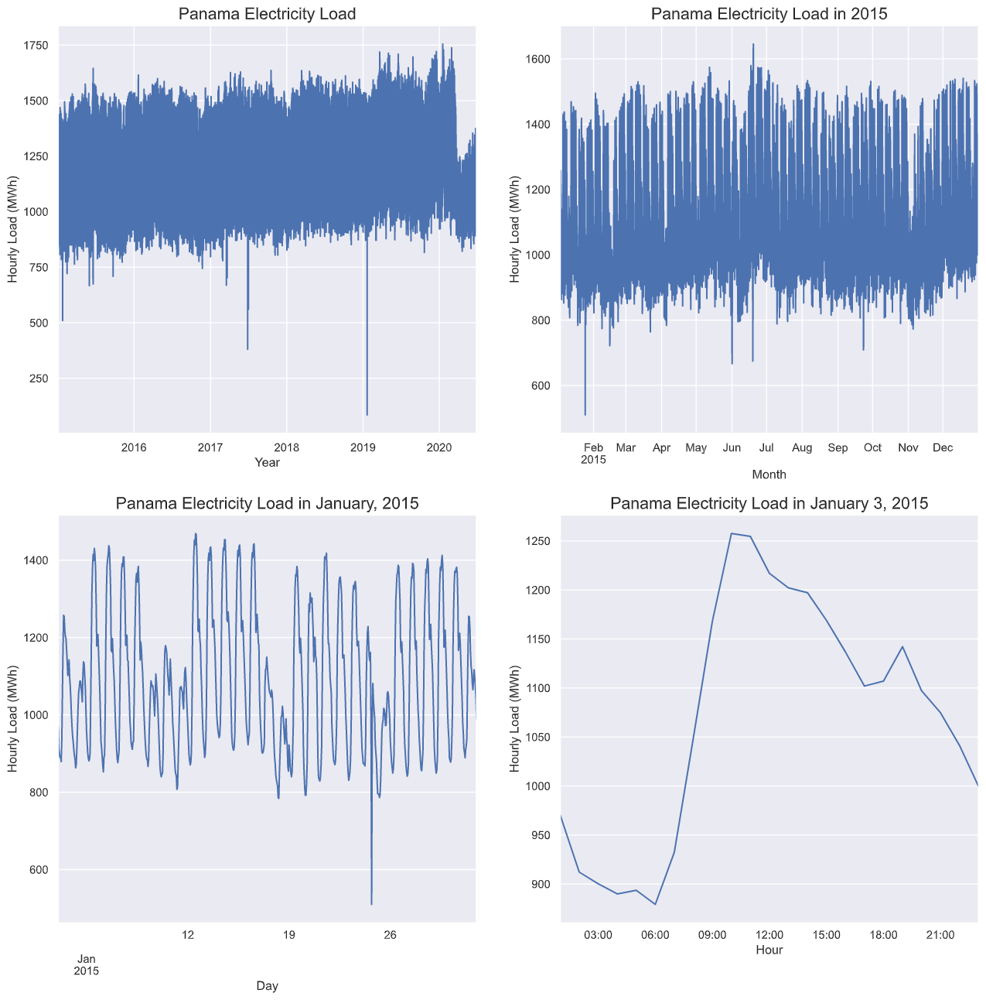
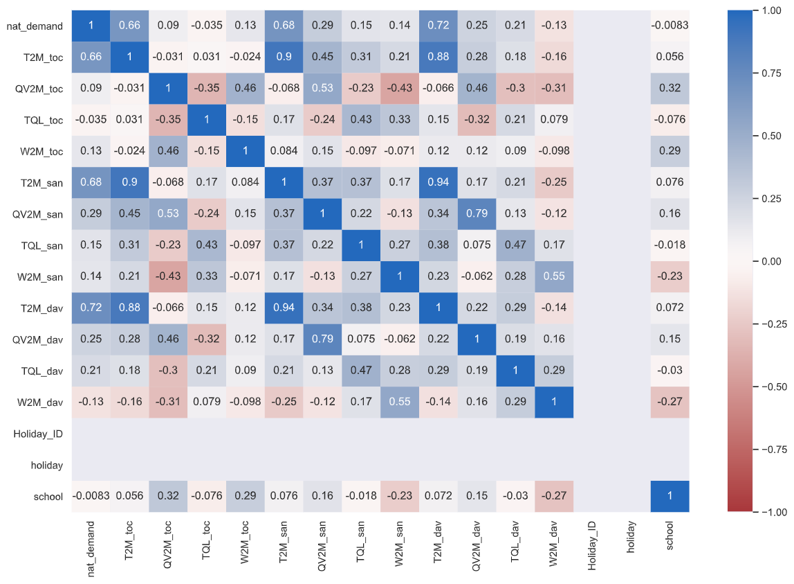
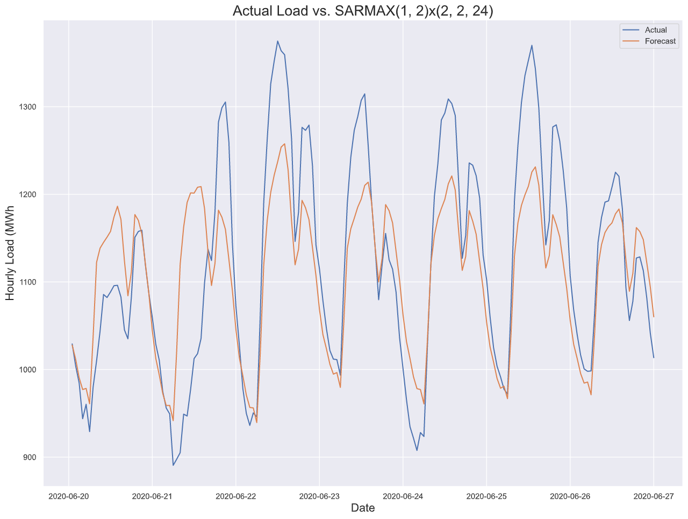

# Forecasting Electricity Demand in Panama

## Project Overview

- Accurate forecasts of electricity demand are detrimental to grid operators. They are used for effective load management, scheduling, economic and business planning, and pricing, among others.
- The goal of this paper is to develop a statistical forecasting model to predict the last week of electricity load in Panama.
- The optimized model utilized follows a seasonal ARMAX(1, 2)x(2, 2)24 order with temperature in degrees Celsius from David city as the exogenous regressor.
- To evaluate the fit and accuracy, model diagnostics were plotted, as well as the mean absolute percentage error (MAPE), mean absolute error (MAE), mean squared error (MSE), and root mean squared error (RMSE) were calculated.
- Evaluation metrics
  - MAPE = 0.053
  - MAE = 59.75
  - MSE = 5942.69
  - RMSE = 77.09

## Code and Resources Used

- Python version: 3.8.3
- Packages: pandas, numpy, matplotlib, seaborn, statsmodels, sklearn, pmdarima
- Citations: See references section in project_paper.pdf

## Data

The data demonstrated in this project is cited from Aguilar Madrid & Antonio (2021) who exercised a machine learning model in forecasting.

### Grid operator (CND)
- Historical load
- Weekly forecasts

### Panama's Ministry of Education
- Calendar information regarding school periods

### “When on Earth?” website
- Calendar information regarding holidays

### Earthdata
- Weather variables for Tocumen, Santiago city, and David city

### Variable Descriptions

|            | Description                                               |
| ---------- | --------------------------------------------------------- |
| datetime   | Date-time corresponding to Panama time-zone UTC-05:00     |
| nat_demand | National electricity load (MWh)                           |
| T2M_toc    | Temperature at 2 meters in Tocumen, Panama city (ºC)      |
| QV2M_toc   | Relative humidity at 2 meters in Tocumen, Panama city (%) |
| TQL_toc    | Liquid precipitation in Tocumen, Panama city (l/m2)       |
| W2M_toc    | Wind Speed at 2 meters in Tocumen, Panama city (m/s)      |
| T2M_san    | Temperature at 2 meters in Santiago city (ºC)             |
| QV2M_san   | Relative humidity at 2 meters in Santiago city (%)        |
| TQL_san    | Liquid precipitation in Santiago city (l/m2)              |
| W2M_san    | Wind Speed at 2 meters in Santiago city (m/s)             |
| T2M_dav    | Temperature at 2 meters in David city (ºC)                |
| QV2M_dav   | Relative humidity at 2 meters in David city (%)           |
| TQL_dav    | Liquid precipitation in David city (l/m2)                 |
| W2M_dav    | Wind Speed at 2 meters in David city (m/2)                |
| Holiday_ID | Unique identification number                              |
| holiday    | Holiday binary indicator                                  |
| school     | School period binary indicator                            |

## Figures

Below are a few figures created throughout the paper.

